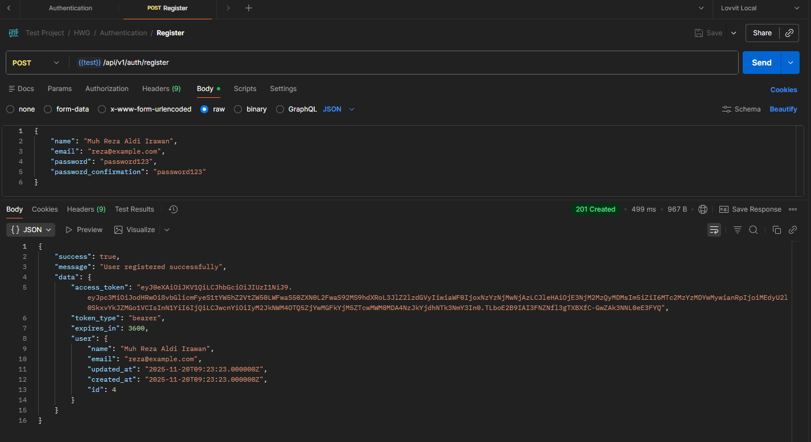
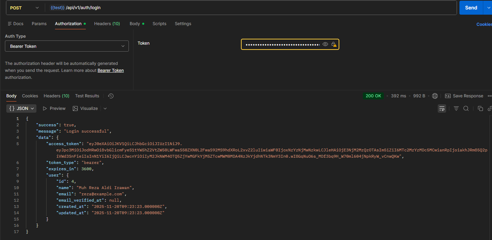
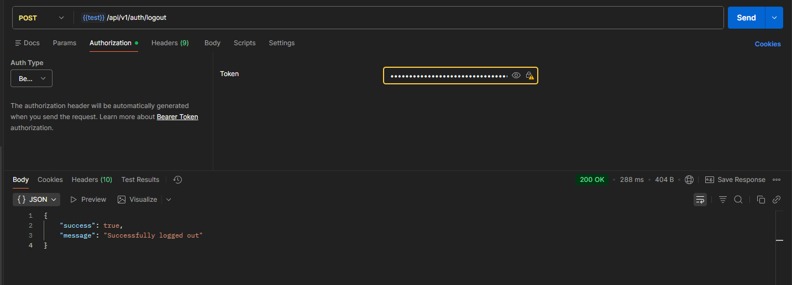

# Library Management System API

REST API untuk sistem manajemen perpustakaan menggunakan Laravel 10 dan JWT Authentication.

## Features

✅ Authentication (Register/Login dengan JWT)  
✅ Category Management (CRUD)  
✅ Book Management (CRUD)  
✅ Borrow Books  
✅ Return Books  
✅ List Borrowed Books  

## Tech Stack

- Laravel 12
- PHP 8.2
- MySQL
- JWT Auth (tymon/jwt-auth)
- RESTful API

## Installation

### 1. Clone Repository

```bash
git clone <repository-url>
cd library-management-api
```

### 2. Install Dependencies

```bash
composer install
```

### 3. Environment Setup

```bash
cp .env.example .env
```

Edit `.env` file dan sesuaikan konfigurasi database:

```env
DB_CONNECTION=mysql
DB_HOST=127.0.0.1
DB_PORT=3306
DB_DATABASE=library_management
DB_USERNAME=root
DB_PASSWORD=
```

### 4. Generate Application Key

```bash
php artisan key:generate
```

### 5. Generate JWT Secret

```bash
php artisan jwt:secret
```

### 6. Run Migrations

```bash
php artisan migrate
```

### 7. Seed Database (Optional)

```bash
php artisan db:seed
```

### 8. Start Development Server

```bash
php artisan serve
```

API akan berjalan di: `http://localhost:8000`

## Running Tests

Aplikasi ini dilengkapi dengan automated testing untuk memastikan semua endpoint bekerja dengan baik.

### Run All Tests

```bash
php artisan test
```

### Run Specific Test File

```bash
# Test Authentication
php artisan test --filter=AuthTest

# Test Categories
php artisan test --filter=CategoryTest

# Test Books
php artisan test --filter=BookTest

# Test Borrows
php artisan test --filter=BorrowTest
```

### Run with Coverage

```bash
php artisan test --coverage
```

### Test Coverage

- ✅ **AuthTest** (9 tests): Register, login, logout, refresh token, profile, validations
- ✅ **CategoryTest** (9 tests): CRUD operations, authorization, soft delete
- ✅ **BookTest** (11 tests): CRUD, search, filter, stock management
- ✅ **BorrowTest** (12 tests): Borrow/return books, stock tracking, authorization

**Total: 43 tests dengan 173 assertions**

## API Documentation

Base URL: `http://localhost:8000/api/v1`

### Authentication

#### Register
```http
POST /auth/register
Content-Type: application/json

{
    "name": "Muh Reza Aldi Irawan",
    "email": "Reza@example.com",
    "password": "password123",
    "password_confirmation": "password123"
}
```



#### Login
```http
POST /auth/login
Content-Type: application/json

{
    "email": "reza@example.com",
    "password": "password123"
}
```



#### Logout
```http
POST /auth/logout
Authorization: Bearer {token}
```



#### Refresh Token
```http
POST /auth/refresh
Authorization: Bearer {token}
```


#### Get Profile
```http
GET /auth/profile
Authorization: Bearer {token}
```


### Categories

#### Get All Categories
```http
GET /categories
Authorization: Bearer {token}
```


#### Create Category
```http
POST /categories
Authorization: Bearer {token}
Content-Type: application/json

{
    "name": "Fiction",
    "description": "Fictional books"
}
```


#### Get Single Category
```http
GET /categories/{id}
Authorization: Bearer {token}
```


#### Update Category
```http
PUT /categories/{id}
Authorization: Bearer {token}
Content-Type: application/json

{
    "name": "Updated Fiction",
    "description": "Updated description"
}
```


#### Delete Category
```http
DELETE /categories/{id}
Authorization: Bearer {token}
```


### Books

#### Get All Books
```http
GET /books
Authorization: Bearer {token}

# Optional query parameters:
# ?category_id=1
# ?search=clean code
```


#### Create Book
```http
POST /books
Authorization: Bearer {token}
Content-Type: application/json

{
    "category_id": 1,
    "title": "Clean Code",
    "author": "Robert C. Martin",
    "isbn": "9780132350884",
    "publisher": "Prentice Hall",
    "publication_year": 2008,
    "stock": 10,
    "description": "A handbook of agile software craftsmanship"
}
```


#### Get Single Book
```http
GET /books/{id}
Authorization: Bearer {token}
```


#### Update Book
```http
PUT /books/{id}
Authorization: Bearer {token}
Content-Type: application/json

{
    "category_id": 1,
    "title": "Updated Title",
    "author": "Updated Author",
    "isbn": "9780132350884",
    "publisher": "Updated Publisher",
    "publication_year": 2008,
    "stock": 15,
    "description": "Updated description"
}
```


#### Delete Book
```http
DELETE /books/{id}
Authorization: Bearer {token}
```


### Borrows

#### Get Borrowed Books
```http
GET /borrows
Authorization: Bearer {token}

# Optional query parameters:
# ?status=active
# ?status=returned
```


#### Borrow Book
```http
POST /borrows
Authorization: Bearer {token}
Content-Type: application/json

{
    "book_id": 1,
    "borrow_days": 14
}
```


#### Return Book
```http
POST /borrows/return
Authorization: Bearer {token}
Content-Type: application/json

{
    "borrow_id": 1
}
```


#### Get Single Borrow
```http
GET /borrows/{id}
Authorization: Bearer {token}
```


## Response Format

### Success Response
```json
{
    "success": true,
    "message": "Operation successful",
    "data": {}
}
```

### Error Response
```json
{
    "success": false,
    "message": "Error message",
    "errors": {}
}
```

## Project Structure

```
app/
├── Http/
│   ├── Controllers/
│   │   └── Api/
│   │       ├── AuthController.php
│   │       ├── CategoryController.php
│   │       ├── BookController.php
│   │       └── BorrowController.php
│   ├── Requests/
│   │   ├── Auth/
│   │   ├── Category/
│   │   ├── Book/
│   │   └── Borrow/
│   └── Resources/
│       ├── CategoryResource.php
│       ├── BookResource.php
│       └── BorrowResource.php
├── Models/
│   ├── User.php
│   ├── Category.php
│   ├── Book.php
│   └── Borrow.php
└── Exceptions/
    └── Handler.php

database/
├── migrations/
└── seeders/

routes/
└── api.php

config/
├── auth.php
└── jwt.php
```

## Testing with Postman

### Import Postman Collection

1. Buka Postman
2. Klik tombol **Import**
3. Pilih file `postman_collection.json` yang ada di root project
4. Collection akan otomatis ter-import dengan semua endpoint

### Testing Steps

1. Pastikan server sudah berjalan (`php artisan serve`)
2. Collection sudah memiliki variable `base_url` = `http://localhost:8000/api/v1`
3. Register user baru melalui endpoint **Auth > Register**
4. Login dan copy `access_token` dari response
5. Simpan token ke variable `token` di collection atau langsung paste ke header Authorization
6. Test semua endpoint dengan format: `Bearer {token}`

**Note**: Token akan expire sesuai TTL yang diset di config JWT (default 60 menit)

## Pull Request 

1. **PR #1**: Setup & Authentication
2. **PR #2**: Category Management
3. **PR #3**: Book Management
4. **PR #4**: Borrow & Return Management

## License

MIT License
